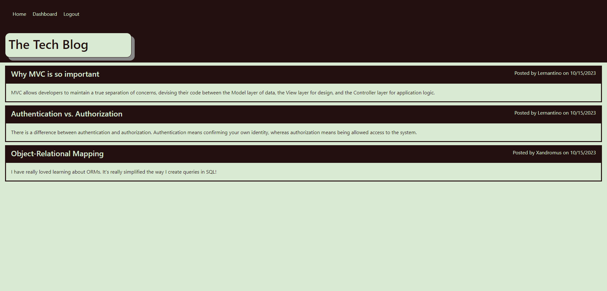

# Mod-14-The-Tech-Blog

## Description

A CMS-style blog site that allows logged in users to publish articles, blog posts, and their thoughts and opinions.  Users can also comment on existing posts

## Installation

Project has a dependencies the user must run npm install to include the needed libraries. Additionally, node.js and mySQL must be installed.

## Usage

To run locally, first source the db/schema.sql file in mySQL.  Then run "npm run seed && npm run start" from the installed folder. 

The following image shows the application's appearance:

Project is also deployed to https://mod-14-the-tech-blog-production.up.railway.app/

## Credits

N/A

## License

N/A
